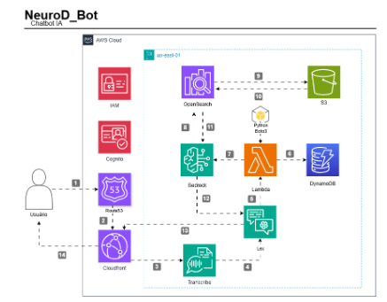

# NeuroD_Bot
 Projeto de Chatbot utilizando Python e Amazon Bedrock para auxiliar pessoas com TDAH e TEA em seus quadros de crises ou organização no geral.

# Documentação — NeuroD_Bot

| Meta de Lançamento | 06 de março de 2025 |
| --- | --- |
| Épico | Desenvolver chatbot com Inteligente Artificial com Python e Amazon Bedrock, auxiliando pessoas com Transtorno de Déficit de Atenção e Hiperatividade e Transtorno do Espectro Autista, dando dicas de organização, bem estar emocional, sensorial e diferentes técnicas para variados cenários   |
| Status do documento | Concluído |
| Equipe de desenvolvedores | PYTHON - Walbens Charles, Mariana Rouxinol, Aline Conchetta |
| Scrum Master | Isabéli Januário |
| Líder Técnico | Gustavo Passos |
| Arquitetos | Mariana Rouxinol |

## 🎯 Objetivo

Este projeto possui o objetivo de, através da linguagem Python e utilizando o Amazon Bedrock da AWS para usar modelo de linguagem, construir uma solução de inteligência artificial, a fim de ajudar pessoas com Transtorno de Déficit de Atenção e Hiperatividade e Transtorno do Espectro Autista (TDAH e TEA) em seus quadros de crises ou organização no geral.

O principal objetivo com a solução é auxiliar pessoas com TDAH e TEA a se ajustarem com o dia-a-dia, tendo essa condição que pode tornar algo simples bem desafiador, através de dicas de técnicas e apps de organização, afim de estabelecer uma rotina para estudos e organização em geral. Ou, também, para quadro de crises, com as melhores dicas e soluções pensando no quadro, tais como ajustes sensoriais (ambiente, iluminação, sons, tato, cheiros) e como lidar com shutdowns e meltdowns.

📌 Importante destacar que, a solução é apenas uma ferramenta de auxílio, e não uma substituição de tratamento psicológico/psiquiátrico.

O projeto abrange todo o ciclo de desenvolvimento, desde a definição de requisitos, passando por arquitetura e design thinking.

## 📊 Indicadores de missão cumprida:

### **Indicadores de Sucesso**

O chatbot deve ser capaz de:

- **Interagir com o usuário de forma satisfatória;**
- **Armazenar os dados do usuário** para trazer informações personalizadas referente ao transtorno que for mencionado;
- De acordo com relato, irá processar em sua base de dados para oferecer a melhor abordagem para a situação;
- **Indicar ações imediatas que podem ser feitas (ajustes ambientais, sensoriais, mindfulness, etc)**
- **Fornecer dicas personalizadas para organização geral e de estudos e alimentação pensadas justamente para o quadro relatado**
- **Escalabilidade e Uso da IA:** Integração funcional com o modelo Amazon Bedrock.

## 📜 Premissas

- Utilização de Python e Amazon Bedrock para desenvolvimento.
- Aplicação de todo o ciclo de desenvolvimento de software.
- Organização de equipes com papéis bem definidos.
- Criação e uso de um documento de requisitos detalhado.
- Entregas incrementais com progresso contínuo.
- Implementação de uma arquitetura escalável e eficiente.
- Entrega de todas as etapas dentro dos prazos estabelecidos.

## 📑 Requisitos

### **Requisitos Funcionais**

- Serviço LEX - ChatBot
- Serviço Via Back-end → Python
- Armazenamento e Personalização de dados com dynamoDB
- Processamento de áudio para interação por voz - integração com amazon transcribe
- Armazenamento e integração de arquivos com s3
- Serviço OpenSearch para busca inteligente
- Processamento inteligente de linguagem natural com Amazon Bedrock com geração de respostas rápidas e personalizadas

### **Requisitos Não Funcionais**

**Desempenho**:

- O chatbot deve ser responsivo, com tempo de resposta rápido para as interações do usuário. A aplicação deve garantir que as interações ocorram sem atraso perceptível, proporcionando uma experiência fluida ao usuário.

**Linguagem utilizada e Bibliotecas:**

- A linguagem utilizada será Python;
- Utilização da biblioteca Boto3 para comunicação eficiente com os serviços AWS, permitindo manipulação de recursos de forma programática.

**Uso de um serviço de Inteligência Artificial para processamento e resposta:**

- Utilização do serviço Amazon Bedrock para geração das respostas personalizadas com base na documentação fornecida;

## 📖 Histórias de Usuário

***R1 → Como um usuário, quero interagir com a aplicação através do chatbot para que possa obter informações sobre como lidar com questões envolvendo TDAH e/ou TEA***

- **Critérios de aceite:**
    - O chatbot deve responder enfaticamente e de forma tranquilizadora para aproximar o usuário
    - O usuário deve poder adicionar mais informações referentes a comorbidades (Depressão, ansiedade, bipolaridade, etc)

***R2 →Como um usuário, quero que a aplicação gere um plano emergencial para crises ou dicas para rotina/organização como um todo, além como alimentação***

- **Critérios de aceite:**
    - O plano deve ser adaptado aos objetivos do usuário (Qual a queixa, quais comorbidades, se é diagnosticado, etc.;
    - O plano deve ser apresentado de forma clara e intuitiva.
    

***R3 → Como um desenvolvedor, quero utilizar o DynamoDB e o CloudFront para que os dados dos usuários sejam armazenados de forma segura e escalável com um tempo de resposta rápido e satisfatório.***

- **Critérios de aceite:**
    - Os dados pessoais dos usuários devem ser armazenados de forma segura.
    - O tempo de resposta deve ser adequado para um uso eficiente da aplicação.

***R4 → Como um desenvolvedor, quero utilizar funções Lambda para realizar a análise dos dados dos usuários e para que seja feita a integração entre os serviços.***

- **Critérios de aceite:**
    - A função Lambda deve Armazenar os dados em um DynamoDB;
    - A  função Lambda deve utilizar o serviço do Amazon Bedrock para gerar respostas personalizadas com base nos dados do usuário.

***R5 → Como um desenvolvedor, quero integrar a aplicação com o OpenSearch para que o usuário possa realizar buscas por aplicativos mencionados ou se aprofundar em alguma técncia mencionada.***

- **Critérios de aceite:**
    - O OpenSearch deve indexar uma base de dados referente a crises em TDAH/TEA e ténicas ou apps de organização no geral.
    - Os resultados da busca devem ser relevantes e personalizados.

## 🧑‍💻 Tecnologias & Ferramentas

### Serviços Utilizados e suas Funcionalidades

- **IAM:** Garante a segurança da aplicação, controlando quem acessa quais recursos da AWS e com quais permissões.
- **Route 53:** Direciona o tráfego de internet para a aplicação, atuando como um DNS inteligente, otimizando a rota para o usuário.
- **CloudFront:** Acelera a entrega de conteúdo estático da aplicação, como imagens e scripts, para os usuários, melhorando a performance.
- **AWS Lambda:** Utilizado para executar os códigos python da aplicação, usando a biblioteca Boto3 para interagir com os serviços do Bedrock e Lex.
- **Amazon Transcribe:** Conversão de áudio para texto, permitindo interações faladas.
- **Lex:** Permite criar interfaces de conversação, como chatbots, para interagir com os usuários de forma natural e intuitiva.
- **Cognito:** É utilizado para gerenciar autenticação, permitindo que usuários acessem o chatbot com segurança.
- **DynamoDB:** Armazena dados de forma flexível e escalável, como informações dos usuários e suas interações com o chatbot.
- **S3:** Armazena arquivos de diversos tipos, como modelos de linguagem, resultados de análises e outros dados necessários para a aplicação.
- **OpenSearch:** Permite realizar buscas eficientes em grandes volumes de dados, como encontrar exercícios específicos ou informações relevantes para o usuário.
- **Bedrock:** Gera conteúdo personalizado, como texto, código e imagens, tornando as respostas do chatbot mais relevantes e personalizadas.

## 🛠️ Arquitetura

## 📌 Backlog | Melhorias

- Amazon CloudWatch: Para monitorar desempenho, uso da aplicação e tempo de resposta.
- Amazon Connect: Canal direto de suporte .
- Amazon SES: Para coletar feedback por e-mail.
- Amazon Translate: Para oferecer suporte a diversos idiomas e melhorar a acessibilidade.
- FinOps: Avaliar uma alternativa para o opensearch com intuito reduzir custos da aplicação
- Amazon ElastiCache: Para armazenar respostas frequentes e evitar chamadas repetidas ao Bedrock, melhorando o tempo de resposta.
